# Hi 👋 I'm kairowan

 

  📱 Android · 🐹 Go · 🟨 JavaScript · 🤖 AI Engineering

  
  

---

## 🚀 About Me

- 👨‍💻 Android 应用开发工程师，当前专注于 **Android AI 应用方向**
- 🐹 使用 Go、JavaScript 进行服务、工具及应用功能开发
- 🧠 关注端侧推理、模型接入与部署、音视频与 AI、性能与体验优化
- 🤖 正在深入理解、学习和实践 AI，持续探索 LLM、RAG、Agent、多模态与 AI 应用工程
- 🏗️ 重视模块化、组件化、Clean Architecture 与工程可维护性
- ✍️ 持续记录 Android、AI 与工程化相关的实践经验
- 🤝 可承接第三方外包与技术合作，也欢迎交流 Android AI 应用开发

---

## 🧰 What I Can Help With

- 🤖 **Android AI 落地**
  - TensorFlow Lite / ONNX Runtime 接入
  - 模型加载、预处理、推理和结果后处理
  - 端侧推理线程、内存、耗电与启动性能优化

- 🎙️ **音视频与 AI**
  - 音视频采集、编解码和处理链路
  - 降噪、VAD、音频分段和实时处理
  - AI 模型与音视频业务结合

- 🧩 **工程化与架构**
  - Android 模块化与组件化
  - Clean Architecture
  - 复杂项目重构与可维护性提升
  - 构建流程与应用性能优化

---

## 🛠️ Tech Stack

 

 

---

## 🧠 AI Learning & Practice

- 🔬 **深入理解**：持续学习模型能力边界、上下文、推理过程、幻觉与评估方法
- 🧩 **应用实践**：探索 LLM API 接入、Prompt 设计、结构化输出与业务流程集成
- 📚 **知识增强**：学习并实践 Embedding、向量检索、RAG 与知识库问答
- 🤝 **Agent 工程**：关注工具调用、任务编排、记忆、状态管理与多 Agent 协作
- 🎨 **多模态方向**：探索文本、图像、语音及 Android 端侧 AI 的组合应用
- ⚙️ **工程落地**：使用 Android、Go 和 JavaScript 构建 AI 应用、服务与交互界面

---

## 🎯 Current Focus

---

## 📝 Tech Writing

- ✍️ [CSDN 技术博客](https://blog.csdn.net/weixin_53760974)
- 📚 Android 应用开发
- 🤖 Android AI 与端侧推理
- 🧠 LLM、RAG、Agent 与 AI 应用工程
- 🐹 Go 与 JavaScript 开发实践
- 🎙️ 音视频工程实践
- 🧩 架构、工程化与项目重构
- ⚡ Android 性能优化

---

## 🐍 Contribution Activity

<picture>
  <source
    media="(prefers-color-scheme: dark)"
    srcset="https://raw.githubusercontent.com/kairowan/kairowan/output/github-snake-dark.svg"
  />
  <source
    media="(prefers-color-scheme: light)"
    srcset="https://raw.githubusercontent.com/kairowan/kairowan/output/github-snake.svg"
  />
  
</picture>

---

## 🤝 Connect

- 💬 欢迎交流 Android AI、LLM 应用、RAG、Agent、Go、JavaScript 与工程化实践
- 🤝 可承接 Android 应用开发、AI 功能接入、性能优化与项目重构
- ✍️ 博客：[CSDN](https://blog.csdn.net/weixin_53760974)
- 📮 邮箱：[gaohaonan45@gmail.com](mailto:gaohaonan45@gmail.com)

---

